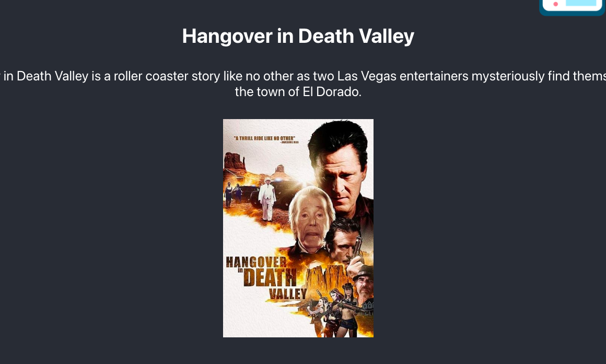
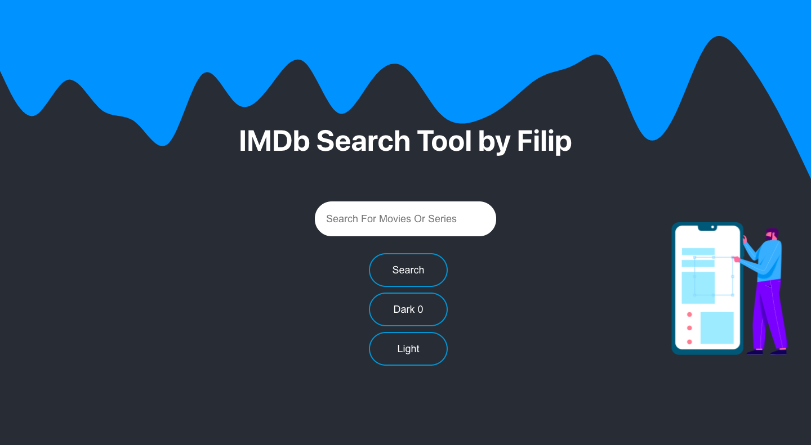

#IMDb Search Tool 🎥
A simple, intuitive IMDb search tool created with React.js. This application allows users to search for their favorite movies or series and get instant results. The tool features a dark mode, a responsive design with dynamic image visibility based on the screen dimensions, and uses Firebase for hosting.

##Preview




##Live Demo
Check out the live project here: https://imdb-search-tool.web.app/

##Features
🌓 Dark mode toggle
🖼 Dynamic image visibility based on viewport
🎬 Fetches movie and series information using the IMDb API
🔍 Instant search results as you type
📱 Fully responsive design
🔥 Hosted with Firebase for seamless user experience
##Note 🚨
The application initially used a free IMDb API, but it has been revoked due to misuse. Always ensure that you use API keys responsibly and don't expose them to the public.

##Development
The project is created using:

React.js for the frontend
Firebase for analytics and hosting

##Setup and Installation
- Clone the repository.
```
git clone https://github.com/yourusername/IMDb-Search-Tool.git
```
- Install dependencies.

```
npm install
```
- Replace the Firebase configurations (apiKey, authDomain, etc.) in App.js with your own credentials.

- Start the local development server.

```
npm start
npm run build
firebase deploy
```
###Contributions
Pull requests are welcome! Please make sure to update the tests as appropriate.

###License
MIT
